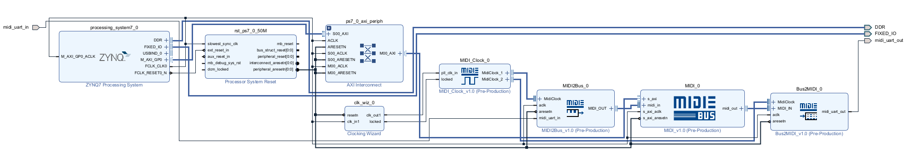
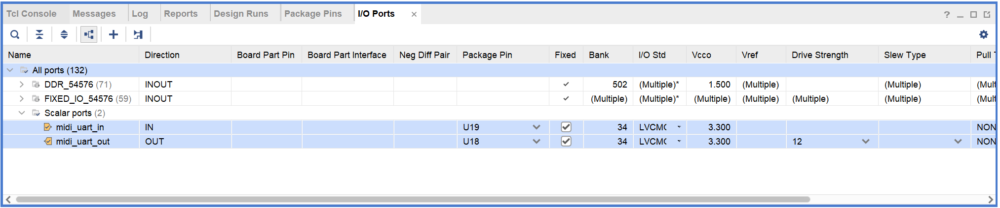

# MIDI IPを利用してFPGA(PL)とARM(PS)を併用してMIDIを送受信するサンプル

Xilinx製FPAG開発環境VivadoとXilinx製ARM開発環境Vitisで動作するサンプルです。

TODO

なお、この使い方はVivadoの使い方に慣れている方向けの説明となります。  
Vivadoの使い方に関しては[FPGAプログラミング大全 Xilinx編](https://www.amazon.co.jp/dp/4798063266)などを参考にしてください。

# 使い方

## パラメーター
このサンプルではFPGA上の以下のピンに以下の信号が入力されている前提で説明を行ないます。  
なお、この例はPynqに mi Audio I/O Board (Main) v1.0を接続した場合の例となります。  
そのほかのボードや環境をお使いの場合は適宜変更をお願いします。

|信号名|Zynq ピン番号|ボードピン名|説明|
|:----:|:----:|:----:|:----:|
|midi_uart_in|U19|JA3_N(PMODA-8)|MIDI入力|
|midi_uart_out|U18|JA3_P(PMODA-7)|MIDI出力|

※PMODA-7/8は mi Audio I/O Board (Main) v1.0 をPynqのPMODに接続した際にMIDI入出力へ接続されるピンです。

また、Zynq PSの設定には https://digilent.com/reference/programmable-logic/pynq-z1/start で配布されているZynq Presetsを用います。

## プロジェクト作成
1. Vivadoを起動

1. Create Projectを選択

1. Project Nameは任意、Project Locationはvivadoフォルダーを、create subdirectoryはチェックを外して Next

1. RTL Project を選択し Do not specify source at this timeを選択しNext

1. お使いのボードもしくはデバイスを選択しNext+Finish

## Block Design作成
1. ToolからRun Scriptを選択し、create_bd.tclを選択

1. Block Diagramが表示され、図のようなブロックデザインが生成されているかを確認します

TODO

1. Block DiagramのZynq7 Processing Systemをダブルクリック

1. Re-customize IP ZYNQ7 Processing Systemダイアログが表示されるため、PresetsからApply Configurationを選択し、Zynq PresetsのTCL/(Pynqの場合pynq_revC.tcl)を選択しOKを選択してダイアログを閉じます

1. Blob DiagramのRun Block Automationを選択し表示されたダイアログのOKを押します

1. Blob DiagramのRun Connection Automation が表示されている場合は選択し表示されたダイアログのOKを押します

1. SourcesのDesigne Sourcesからmidi_pl_ps_standaloneを右クリックし、Create HDL Wrapperを選択します

1. Create HDL WrapperダイアログでLet Vivado manage wrapper and auto-updateにチェックが入っていることを確認してOKを選択します

## 合成
1. Flow NavigatorのSYNTHESISからRun Synthesisを選択します

1. 合成完了後 Synthesis Completedダイアログが表示されますのでCancelで閉じます

## ピン設定

1. Flow NavigatorのOpen Synthesized Designを選択します

1. 右上のウィンドウレイアウトから I/O Planningを選択します

1. I/O Portsタブを開き、各入出力ピンのPackage PinのとI/O Stdを設定します  
例の場合は図のように設定します
 TODO

1. Ctrl+Sを押して保存します。Save Constraintsダイアログが表示されるため、File nameに適当な名前を入力してOKを選択します。

## 再合成~ビットストリーム生成
1. Flow NavigatorのPROGRAM AND DEBUGからGenerate Bitstreamを選択します。

1. しばらくすると、Bitstream Generation Copletedダイアログが表示されるのでCancelで閉じます。

1. FileからExport、Export Hardwareを選択ます

1. Export Hardware Platformダイアログが表示されるためNextを選択

1. Include bitstreamを選択しNextを選択

1. xsaファイルの生成先を記録しFinishを選択

## ARMプロジェクト作成

1. VivadoのToolsからLaunch Vitis IDEを選択します

1. Vitis IDE Launcherダイアログが表示されるため、Workspaceにsdkフォルダーを指定しLaunchを選択

1. Create Appliaction Porojectを選択

1. New Application Projectダイアログが表示されるためNextを選択

1. Create a new plaform fron hardware(XSA)タブをせたくし、BrowseをクリックしてVivadoで生成したxsaファイルを選択

1. New Application ProjectダイアログのNextを選択

1. Application project nameにMainと入力しNextを選択

1. Domein画面はNextを選択

1. TemplatesはEmpty Application(C++)を選択しFinishを選択

## C++コード追加とプロジェクト設定

TODO

* ビルド設定変更
Explorer/Main_system/「Main[Application]」を右クリック>「Property」

Properties for Mainダイアログ>「C/C++ Build」>「Settings」>ToolSettingsタブ ARM v7 g++ compiler「Miscellaneous」>「Other flags」に「-std=c++14」を追加

## C++プログラムのビルド

* アプリケーションプロジェクトをビルド
「Assistant」>「XXX[Application]」の「Debug」を右クリック>「Build」

## 実行設定作成

* RunConfigurationの変更
「Run」>「Configuration」>「Single Application Debug」>「RUN」

## 実行
