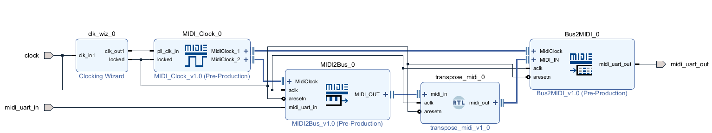
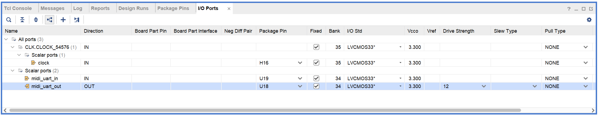

# MIDI IPを利用してFPGA(PL)上でMIDIを送受信するサンプル

Xilinx製FPAG開発環境 Vivadoで動作するサンプルです。

PL上に構築したMIDI送信IP(Bus2MIDI)とMIDI受信IP(MIDI2Bus)を用いて入力されたMidiのNote Onのノートの値を1加算して送信するサンプルです。
(トランスポーズを行なう回路です-Note Offはケアしていないため音は止まりません。)

なお、この使い方はVivadoの使い方に慣れている方向けの説明となります。  
Vivadoの使い方に関しては[FPGAプログラミング大全 Xilinx編](https://www.amazon.co.jp/dp/4798063266)などを参考にしてください。

# 使い方

## パラメーター
このサンプルではFPGA上の以下のピンに以下の信号が入力されている前提で説明を行ないます。  
なお、この例はPynqに mi Audio I/O Board (Main) v1.0を接続した場合の例となります。  
そのほかのボードや環境をお使いの場合は適宜変更をお願いします。

|信号名|Zynq ピン番号|ボードピン名|説明|
|:----:|:----:|:----:|:----:|
|clock|H16|SYSCLK|クロックソース(125MHz)|
|midi_uart_in|U19|JA3_N(PMODA-8)|MIDI入力|
|midi_uart_out|U18|JA3_P(PMODA-7)|MIDI出力|

※PMODA-7/8は mi Audio I/O Board (Main) v1.0 をPynqのPMODに接続した際にMIDI入出力へ接続されるピンです。

## プロジェクト作成
1. Vivadoを起動

1. Create Projectを選択

1. Project Nameは任意、Project Locationはvivadoフォルダーを、create subdirectoryはチェックを外して Next

1. RTL Project を選択し Do not specify source at this timeを選択しNext

1. お使いのボードもしくはデバイスを選択しNext+Finish

## Block Design作成
1. ToolからRun Scriptを選択し、create_bd.tclを選択

1. Block Diagramが表示され、図のようなブロックデザインが生成されているかを確認する

1. Block Diagramのclockを選択し、External Port PropertiesのFrequencyをお使いのボードのクロックソースの周波数に合わせます  
Pynqの場合は125MHzです。

1. SourcesのDesigne Sourcesからmidi_pl_standaloneを右クリックし、Create HDL Wrapperを選択します

1. Create HDL WrapperダイアログでLet Vivado manage wrapper and auto-updateにチェックが入っていることを確認してOKを選択します

## 合成
1. Flow NavigatorのSYNTHESISからRun Synthesisを選択します

1. 合成完了後 Synthesis Completedダイアログが表示されますのでCancelで閉じます

## ピン設定

1. Flow NavigatorのOpen Synthesized Designを選択します

1. 右上のウィンドウレイアウトから I/O Planningを選択します

1. I/O Portsタブを開き、各入出力ピンのPackage PinのとI/O Stdを設定します  
例の場合は図のように設定します

1. Ctrl+Sを押して保存します。Save Constraintsダイアログが表示されるため、File nameに適当な名前を入力してOKを選択します。

## 再合成~ビットストリーム生成
1. Flow NavigatorのPROGRAM AND DEBUGからGenerate Bitstreamを選択します。

1. しばらくすると、Bitstream Generation Copletedダイアログが表示されるのでCancelで閉じます。

## 書き込み

1. FPGAを接続し Flow NavigatorのPROGRAM AND DEBUGからOpen Hardware Managerを選択し、Open Targetを選択しAuto Connectを選択します

1. FPGAに接続されたことを確認しFlow NavigatorのPROGRAM AND DEBUGからProgram Deviceを選択し、書き込み先のFPGAを選択します

1. Program Deviceダイアログが表示されるので、Programを選択します

1. 書き込み完了と同時に回路が起動します。 MIDI信号のノートONをMIDI入力に送ると送ったノートONのノート番号から1つ加算されたノートONがMIDI出力から出力されることを確認してください。
