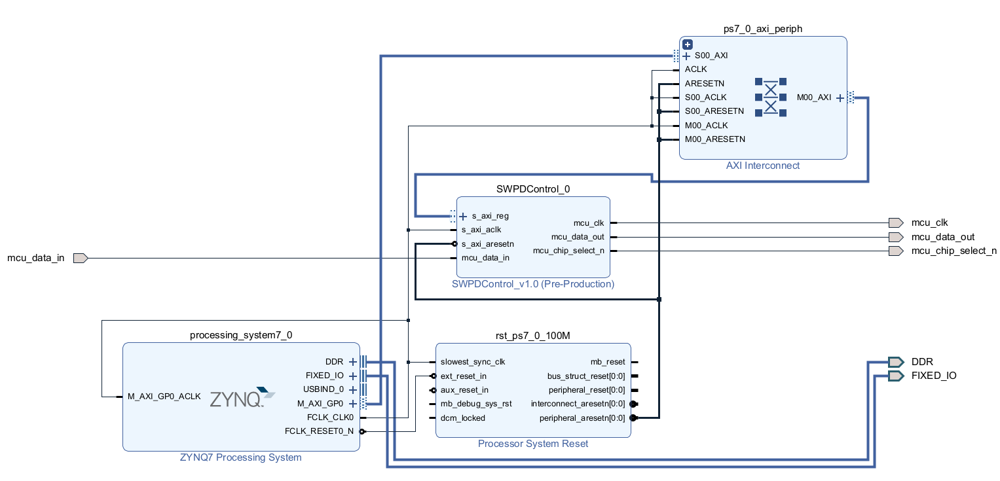
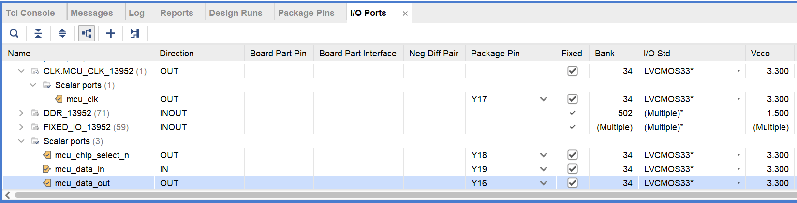

# SWPD IPを利用してFPGA(PL)とARM(PS)を併用してボリュームペダル・フットスイッチの値を読み出すサンプル

Xilinx製FPAG開発環境VivadoとXilinx製ARM開発環境Vitisで動作するサンプルです。

PL上に構築したSWPD IP(SWitch-PeDal IP)を用いて mi Audio I/O Board (Main) v1.0上のMCUと通信し、ボリュームペダル・フットスイッチの値を読み出し、CPU上で出力を行なうサンプルです。

なお、この使い方はVivadoの使い方に慣れている方向けの説明となります。  
Vivadoの使い方に関しては[FPGAプログラミング大全 Xilinx編](https://www.amazon.co.jp/dp/4798063266)などを参考にしてください。

# 使い方

## パラメーター
このサンプルではFPGA上の以下のピンに以下の信号が入力されている前提で説明を行ないます。  
なお、この例はPynqに mi Audio I/O Board (Main) v1.0を接続した場合の例となります。  
そのほかのボードや環境をお使いの場合は適宜変更をお願いします。

|信号名|Zynq ピン番号|ボードピン名|説明|
|:----:|:----:|:----:|:----:|
|mcu_chip_select_n|Y18|JA1_P(PMODA-1)|MCUチップセレクト|
|mcu_clk|Y17|JA2_N(PMODA-4)|MCU クロック|
|mcu_data_in|Y19|JA1_N(PMODA-2)|MCU データMISO|
|mcu_data_out|Y16|JA2_P(PMODA-3)|MCU データMOSI|

※PMODA-1/2/3/4は mi Audio I/O Board (Main) v1.0 をPynqのPMODに接続した際にMCUへの通信用バスへ接続されるピンです。

また、Zynq PSの設定には https://digilent.com/reference/programmable-logic/pynq-z1/start で配布されているZynq Presetsを用います。

## プロジェクト作成
1. Vivadoを起動

1. Create Projectを選択

1. Project Nameは任意、Project Locationはvivadoフォルダーを、create subdirectoryはチェックを外して Next

1. RTL Project を選択し Do not specify source at this timeを選択しNext

1. お使いのボードもしくはデバイスを選択しNext+Finish

## Block Design作成
1. ToolからRun Scriptを選択し、create_bd.tclを選択

1. Block Diagramが表示され、図のようなブロックデザインが生成されているかを確認します

1. Block DiagramのZynq7 Processing Systemをダブルクリック

1. Re-customize IP ZYNQ7 Processing Systemダイアログが表示されるため、PresetsからApply Configurationを選択し、Zynq PresetsのTCL/(Pynqの場合pynq_revC.tcl)を選択します

1. Re-customize IP ZYNQ7 Processing SystemダイアログのPage NavigatorからClock Confiugrationを選択し、ComponentのPL Fabric ClocksのFCLK_CLK0のRequested Frequeycn(MHz)を確認してダイアログのOKを押してダイアログを閉じます

1. Blob DiagramのRun Block Automationを選択し表示されたダイアログのOKを押します(Run Block Automationが表示された場合のみ)

1. Blob DiagramのRun Connection Automationが表示されている場合は選択し表示されたダイアログのOKを押します(Run Connection Automationが表示された場合のみ)

1. Block DiagramのClocking Wizardをダブルクリック

1. Clocking OptionsのInput Clock InformatrionのPrimaryのInput Frequency(MHz)が先ほど確認したFCLK_CLK0の周波数と一致しているかを確認します  
もし、周波数がおかしい場合はAutoからManualに変更し手動でクロックを入力してください。

1. SourcesのDesigne Sourcesからmidi_pl_ps_standaloneを右クリックし、Create HDL Wrapperを選択します

1. Create HDL WrapperダイアログでLet Vivado manage wrapper and auto-updateにチェックが入っていることを確認してOKを選択します

## 合成
1. Flow NavigatorのSYNTHESISからRun Synthesisを選択します

1. 合成完了後 Synthesis Completedダイアログが表示されますのでCancelで閉じます

## ピン設定

1. Flow NavigatorのOpen Synthesized Designを選択します

1. 右上のウィンドウレイアウトから I/O Planningを選択します

1. I/O Portsタブを開き、各入出力ピンのPackage PinのとI/O Stdを設定します  
なお、PS関係のピンの設定(DDR_XXXやFIXED_IO_XXXなど)はデフォルトのまま間としてください。  
例の場合は図のように設定します
 

1. Ctrl+Sを押して保存します。Save Constraintsダイアログが表示されるため、File nameに適当な名前を入力してOKを選択します。

## 再合成~ビットストリーム生成
1. Flow NavigatorのPROGRAM AND DEBUGからGenerate Bitstreamを選択します。

1. しばらくすると、Bitstream Generation Copletedダイアログが表示されるのでCancelで閉じます。

1. FileからExport、Export Hardwareを選択ます

1. Export Hardware Platformダイアログが表示されるためNextを選択

1. Include bitstreamを選択しNextを選択

1. xsaファイルの生成先を記録しFinishを選択

## ARMプロジェクト作成

1. VivadoのToolsからLaunch Vitis IDEを選択します

1. Vitis Unified IDEが起動時、Welcomeページが表示されるので Open Workspaceを選択し、sdkフォルダーを指定しフォルダーの選択を選択

1. Embedded DevelopmentのCreate Platform Componentを選択

1. Create Platform Componentダイアログが表示されるので、Platform名に任意の名前を入力しNextを選択

1. Hardware Design(XSA)のBrowseをクリックしてVivadoで生成したxsaファイルを選択しNextを選択

1. Select Operationg System and Processorの画面が読み込まれた後Operating systemがstandaloneになっていることを確認しNextを選択

1. Summary画面を確認してNextを選択

1. Platformプロジェクト完成後Welcome ページを再度開き、Embedded DevelopmentのCreate Embedded Applicationを選択

1. Create Application Componentダイアログが表示されるので、Component名に任意の名前を入力しNextを選択

1. Select Platform画面で先ほど作成したPlatformを選択してNextを選択

1. Select Domain画面で内容を確認してNextを選択

1. Summary画面を確認してNextを選択

## C++コード追加

1. VITIS COMPONENTSのSDK>Application>Sourcesのsrcを右クリックし、ImportからFilesを選択

1. cppフォルダー内のlscript.ldとmain.cppを選択し開くを選択

## C++プログラムのビルド

1. VITIS COMPONENTSのFLOWのComponentからPlatformを選択しBuildを選択

1. Platformビルド完了後、VITIS COMPONENTSのFLOWのComponentからApplicationを選択しBuildを選択

## 実行設定作成

1. VITIS COMPONENTSのFLOWのComponentからPlatformを選択しRunにマウスカーソルを乗せ、設定ボタンをクリック

1. Initialization fileがxxx[Platform]/platform/hw/ps7_init.tclとなっていることを確認する。もし、そのほかのtclが選択されている場合、Browseを選択し、作成したPlatformの保存先/platform/hw/ps7_init.tclを選択する

## 実行

1. シリアル通信が可能なターミナルを起動し、FPGAのUARTに接続します。  
デフォルトでのボーレートは115200です。

1. VITIS COMPONENTSのFLOWのComponentからPlatformを選択しRunをクリックし実行します。 この際PLのコンフィギュレーションとPSの初期化・起動が行なわれます。
